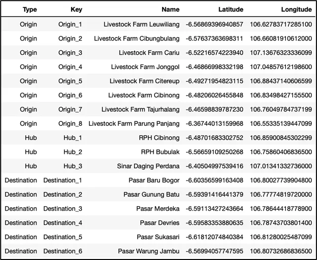

# Beef Distribution Network in Bogor

**Note: This is only a brief introduction of the problem, to grasp and learn about the problem more comprehensibly please visit my Medium article series [HERE](https://medium.com/@lazuardy.almuzaki/list/python-for-optimization-6934218dbe89)**

The problem will be about optimizing Beef Distribution Network in Bogor, Indonesia. This study case is adapted from paper written by Januardi you could access [here](https://www.researchgate.net/publication/347485284_Transshipment_model_considering_environmental_cost_using_mixed_integer_linear_programming_Beef_distribution_problem), with modification. Let’s get into the details

We are acting regional government of Bogor city, let’s say an extension of Ministry of Trade responsible in making sure that the demand for beef is well accomodated. Now since all traditional market are operated by us the government, we are given authority to decide which livestock farm be selected as livestock supplier, and which slaughterhouse to process these livestock be selected. All in all with an objective to minimize all network cost.

Let’s summarize it using previous transshipment problem terminologies, we have 6 market as demand point, 3 hub represented by slaughterhouse, and 8 origin depicted as livestock farm. Below is the geographical representation of the feasible route and location point that effectively connect total of 17 points in our network.

For this problem, we are tasked to minimize the network cost consisting of transportation cost and carbon cost, as our objective function. We are going to elaborate more about these two cost in next chapter.

We are also given livestock farm capacity for each of them, for the optimization should satisfy the constraint that the delivered kilogram of livestock should not exceed the capacity for each farm. Another constraint is that all demand for each market has to be satisfied.

Furthermore, we need to address that this specific adapted case has the hubs having no capacity, or uncapacitated. So we could distribute as many as kilogram of beef in each of them.