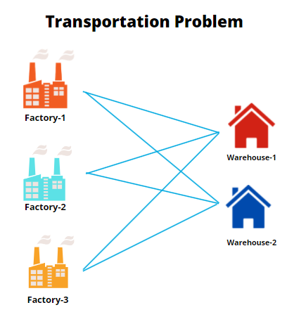

# Vision Corporation: Production Planning and Shipping

## 1. Instruction

Study case in which this folder holds represent a basic, yet challenging, comprehensive case of **Linear Programming** specifically **Allocation** and **Transportation** problem.

*typical transportation problem* ([image source](https://machinelearninggeek.com/wp-content/uploads/2022/01/image-10.png))

----

To start please open the <u>*Vision Corporation Production Planning and Shipping.pdf*</u> within the folder. This file contains the Problem Definition of the case

The problem definition does not come with any mathematical model. And we need to formulate it into those mathematical model if we want to model them in Python. So you can refer to **Mathematical Model.pdf** if you need to confirm the mathematical model. 

Upon learning about the study case and the mathematical model, I provide <u>5 Python Codes</u> that will cover each of questions inquired in the Problem Definition file. The python code model the problem exactly like the way the pdf file of mathematical model constructs it.

To understand what each of 5 codes represent, along with their interpretation of result you will get upon running the code, I provide the <u>**Solution Brief Description**</u> in .pptx format

## 2. Technical Notes (Installing/Initiating Solver)

Well, doing a Linear Programming in Python ought us to prepare the solver. It's kind of external package you need to make sure present because Python alone is not able to solve your model.

Simply put, we use Python and Pyomo to formulate the model, and we use solver package to actually solve it.

Installing solvers are quite different if you doing your code locally or in cloud (e.g. google colab)

Check here for guide in installing solvers in Google Colab: [HERE](https://colab.research.google.com/github/jckantor/ND-Pyomo-Cookbook/blob/master/notebooks/01.02-Running-Pyomo-on-Google-Colab.ipynb)

And if you doing it locally, please refer to the <u>**Solution Brief Description.pptx**</u>. I attach brief procedure in installing solver, specifically cbc over there.

Note: I strongly urge you to explore more about 'solvers' in the internet if you are just new in this realm.

## 3. Learning Outcome

This study case will particularly deep dive in model formulation using Python. But specifically you will also gain some insight about doing sensitivity analysis through modifying constraints. In Operation Research lingo, you will learn what is called by Dual/Shadow Price, and Allowable Increase.
